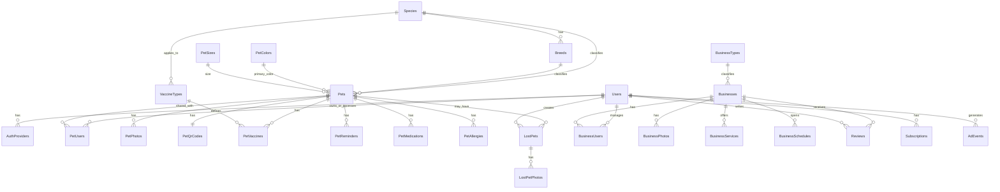

# Piyí - ERD Mermaid v1

Puedes pegar este contenido en un visor compatible con Mermaid.

## Relaciones clave

- `Pets` no pertenece directamente a un único usuario; se relaciona por `PetUsers`.
- `Businesses` no pertenece directamente a un único usuario; se relaciona por `BusinessUsers`.
- `PetQrCodes` mantiene la identidad pública escaneable.
- Los catálogos evitan valores quemados en código.

